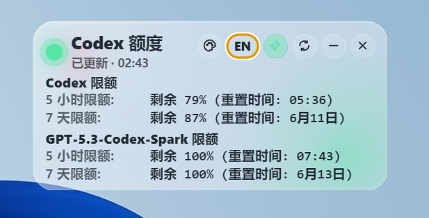
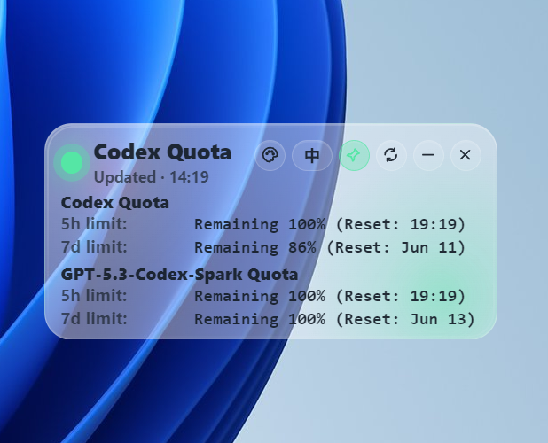
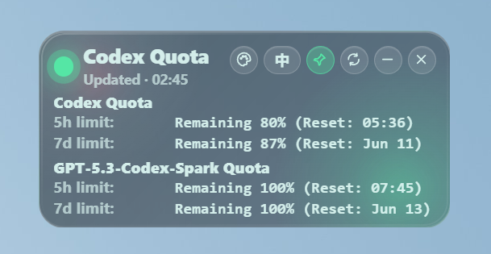
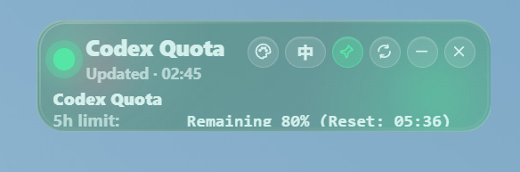
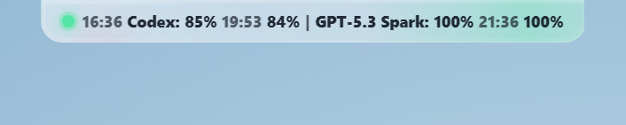
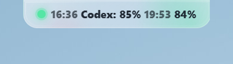
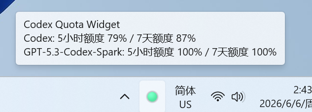
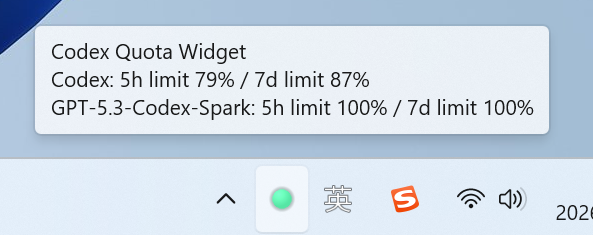

# Codex LED Widget

<p align="center">
  
</p>

<p align="center">
  <strong>A tiny liquid-glass Windows desktop widget for monitoring your local Codex usage quota.</strong>
</p>

<p align="center">
  <strong>一个用于查看本机 Codex 额度使用情况的 Windows 桌面悬浮小组件。</strong>
</p>

<p align="center">
  <a href="#中文说明">中文</a> ·
  <a href="#english">English</a> ·
  <a href="https://github.com/carrieyummy/codex_quota_widget/releases">Download</a>
</p>

---

# 中文说明

Codex LED Widget 是一个 Windows 桌面悬浮小组件，用于显示本机 Codex 的剩余额度、重置时间和额度状态。

它采用透明液态玻璃质感界面，通过红、黄、绿三种 LED 状态显示额度健康度，并支持窗口高度调节、系统托盘状态图标、以及背景色 / 字体色 / 透明度自定义。你不用频繁打开命令行或页面，也能快速知道 Codex 额度是否快用完。

---

## ✨ 功能特点

- 🟢 **红绿灯额度状态**
  - 绿色：剩余额度大于等于 10%
  - 黄色：剩余额度小于 10%，但仍大于 0
  - 红色：剩余额度为 0 或读取失败

- 🪟 **液态玻璃悬浮窗口**
  - 透明桌面小组件
  - 无边框、可拖动、默认置顶
  - 默认显示在屏幕右上角，并记住上次窗口位置和高度

- 📌 **顶部贴边收起**
  - 开启贴边收起后，拖动窗口到屏幕上边缘会自动缩略显示
  - 鼠标悬停在缩略条上会自动展开完整窗口，移出后自动恢复贴边缩略状态
  - 左、右、下边缘只会自动夹回屏幕工作区内，不会切换为缩略显示

- ↕️ **可调节信息密度**
  - 支持拖拽窗口上 / 下边缘调整高度
  - 高度增加时显示更多额度窗口和模型限额
  - 高度减少时自动隐藏次要信息，保留关键额度状态

- 🧭 **系统托盘图标**
  - 托盘 LED 图标颜色跟随额度状态变化
  - 鼠标悬停可查看 Codex 与其他限额的 5 小时 / 7 天剩余额度
  - 托盘菜单支持显示 / 隐藏、刷新额度、置顶切换和退出

- 🎨 **自定义外观**
  - 支持自定义背景色
  - 支持自定义字体色
  - 支持调整窗口透明度
  - 设置会保存在本机，下次打开自动恢复

- 🌐 **支持中文 / English 切换**
  - 内置双语界面
  - 主窗口和托盘提示会跟随语言切换

- 🔄 **自动刷新额度**
  - 自动读取 Codex 使用情况
  - 默认每 60 秒刷新一次
  - 也可以从主窗口或托盘菜单手动刷新

- 🔐 **隐私友好**
  - 使用本机已有的 Codex 登录状态
  - 不需要手动输入 Token
  - 不读取、不保存、不上传、不显示认证 Token

---

## 📸 截图预览

<p align="center">
  
  
</p>

<p align="center">
  
  
</p>

<p align="center">
  
  
</p>

<p align="center">
  
  
</p>

---

## 🚀 下载

请前往 **Releases** 页面下载最新版 Windows `.exe` 文件：

👉 [前往 Releases 下载](https://github.com/carrieyummy/codex_quota_widget/releases)

当前版本：`v1.0.0`

---

## 🖥️ 运行要求

- Windows 10 / Windows 11
- 电脑上已经安装 Codex
- 本机 Codex 已经登录

---

## 📦 使用方法

1. 打开 [Releases](https://github.com/carrieyummy/codex_quota_widget/releases) 页面。
2. 下载最新版本的 `.exe` 文件。
3. 确保电脑上已经安装并登录 Codex。
4. 双击运行 `.exe`。
5. 如果 Windows 提示未知发布者：
   - 点击 **更多信息**
   - 点击 **仍要运行**

---

## 🔴 额度颜色说明

| 颜色 | 含义 |
|---|---|
| 🟢 绿色 | 剩余额度大于等于 10% |
| 🟡 黄色 | 剩余额度小于 10%，但大于 0 |
| 🔴 红色 | 剩余额度为 0，或额度读取失败 |

额度状态会根据本机可读取到的 Codex 使用数据进行计算。窗口中会显示 5 小时限额、7 天限额和对应的重置时间；如果存在多个限额分组，也会一起显示。

---

## 🧭 托盘说明

Codex LED Widget 会在 Windows 系统托盘显示一个 LED 图标。

- 单击托盘图标：显示或隐藏小组件
- 右键托盘图标：打开菜单，可刷新额度、切换置顶或退出
- 鼠标悬停托盘图标：查看 5 小时 / 7 天剩余额度
- 切换中英文后，托盘提示也会同步切换语言

---

## 🎨 外观设置

点击窗口右上角的调色盘按钮，可以调整：

- 背景色
- 字体色
- 窗口透明度

修改会立即生效，并保存在本机 `localStorage` 中。下次启动时会自动恢复上次的外观设置。

---

## 🔐 隐私说明

Codex LED Widget 设计目标是本地化、轻量、隐私友好。

- 使用本机已有的 Codex 登录状态
- 不需要你手动输入 Token
- 不读取你的认证 Token
- 不保存你的认证 Token
- 不上传你的额度数据
- 只显示 Codex 额度相关状态
- 数据保留在你的电脑本地

---

## 🛠️ 本地开发

克隆仓库：

```bash
git clone https://github.com/carrieyummy/codex_quota_widget.git
cd codex_quota_widget
```

安装依赖：

```bash
npm install
```

开发模式运行：

```bash
npm run dev
```

启动应用：

```bash
npm start
```

打包 Windows 便携版：

```bash
npm run build
```

打包完成后，生成文件会出现在 `dist` 文件夹中。

---

## 📁 项目结构

```txt
codex_quota_widget/
├─ assets/              # 截图和图片资源
├─ src/
│  ├─ main/             # Electron 主进程和额度读取逻辑
│  └─ renderer/         # 小组件界面、样式和交互
├─ package.json         # 项目配置和打包脚本
└─ README.md
```

---

## ❓ 常见问题

### 这个工具支持 macOS 或 Linux 吗？

目前主要面向 Windows 使用。如果你需要其他平台支持，可以提交 Issue 或自行适配。

### 我需要手动输入 Codex Token 吗？

不需要。小组件会使用你本机已有的 Codex 登录状态，不需要你手动输入 Token。

### 为什么 Windows 会提示未知发布者？

因为当前应用还没有进行代码签名，所以 Windows 第一次运行时可能会显示安全提醒。如果你确认文件来源可信，可以点击 **更多信息** → **仍要运行**。

### 它会上传我的使用数据吗？

不会。这个工具的目标是读取并显示本机额度状态，不会上传你的额度数据。

### 为什么窗口变矮后少了一些信息？

这是正常行为。窗口高度减少时，小组件会自动隐藏次要限额分组或 7 天限额，优先保留最关键的 Codex 额度状态。

---

## 🧩 技术栈

* Electron
* JavaScript
* HTML
* CSS
* electron-builder

---

## 🤝 参与贡献

欢迎提交 Issue 和 Pull Request。

如果你发现 Bug、有功能建议，或者想改进界面，可以直接打开一个 Issue。

支持：1218615410@qq.com

---

## 📄 开源协议

MIT License

---

<br />

# English

Codex LED Widget is a small Windows desktop widget that shows your local Codex quota, remaining percentage, and reset time.

It uses a transparent liquid-glass interface and a simple red / yellow / green LED status indicator. It also supports adjustable window height, a system tray status icon, and custom background color, text color, and opacity, so you can keep an eye on Codex usage without repeatedly opening a terminal or account page.

---

## ✨ Features

* 🟢 **LED quota indicator**

  * Green: remaining quota is 10% or higher
  * Yellow: remaining quota is below 10% and above 0
  * Red: remaining quota is 0, or the quota read failed

* 🪟 **Liquid-glass desktop widget**

  * Transparent floating window
  * Frameless, draggable, and always-on-top by default
  * Opens near the top-right of the screen and remembers its last position and height

* 📌 **Top-edge dock mode**

  * When edge docking is enabled, dragging the widget to the top edge collapses it into a compact strip
  * Hovering the strip expands the full widget automatically, and moving the mouse away restores the docked strip
  * The left, right, and bottom edges only keep the widget inside the screen work area; they do not trigger compact mode

* ↕️ **Adjustable information density**

  * Drag the top or bottom edge to adjust the widget height
  * Expand the window to show more quota windows and limit groups
  * Shrink the window to hide secondary details and keep the key quota status visible

* 🧭 **System tray icon**

  * Tray LED color follows the current quota state
  * Hover the tray icon to view 5h / 7d remaining quota for Codex and other limit groups
  * Tray menu supports show / hide, refresh, always-on-top toggle, and quit

* 🎨 **Custom appearance**

  * Custom background color
  * Custom text color
  * Adjustable opacity
  * Settings are saved locally and restored on the next launch

* 🌐 **Chinese / English interface**

  * Built-in language switch
  * Main window and tray tooltip follow the selected language

* 🔄 **Automatic refresh**

  * Reads Codex usage automatically
  * Refreshes every 60 seconds by default
  * Manual refresh is available from both the widget and the tray menu

* 🔐 **Privacy-friendly**

  * Uses your local Codex sign-in state
  * Does not ask you to enter a token
  * Does not read, save, upload, or display your authentication token

---

## 📸 Screenshots

<p align="center">
  
  
</p>

<p align="center">
  
  
</p>

<p align="center">
  
  
</p>

<p align="center">
  
  
</p>

---

## 🚀 Download

Download the latest Windows `.exe` from the **Releases** page:

👉 [Download from Releases](https://github.com/carrieyummy/codex_quota_widget/releases)

Current version: `v1.0.0`

---

## 🖥️ Requirements

* Windows 10 / Windows 11
* Codex installed on your computer
* Codex already signed in locally

---

## 📦 How to Use

1. Go to the [Releases](https://github.com/carrieyummy/codex_quota_widget/releases) page.
2. Download the latest `.exe` file.
3. Make sure Codex is installed and signed in on your computer.
4. Double-click the `.exe` to run the widget.
5. If Windows shows an unknown publisher warning:

   * Click **More info**
   * Click **Run anyway**

---

## 🔴 Quota Status

| LED Color | Meaning |
|---|---|
| 🟢 Green | Remaining quota is 10% or higher |
| 🟡 Yellow | Remaining quota is below 10% but above 0 |
| 🔴 Red | Remaining quota is 0, or the quota read failed |

The remaining quota is calculated from Codex usage data available on your local machine. The widget shows 5h limits, 7d limits, and reset times. If multiple limit groups are available, they are shown together.

---

## 🧭 Tray

Codex LED Widget adds an LED icon to the Windows system tray.

* Click the tray icon to show or hide the widget.
* Right-click the tray icon to refresh quota, toggle always-on-top, or quit.
* Hover the tray icon to view 5h / 7d remaining quota.
* The tray tooltip follows the selected Chinese / English language.

---

## 🎨 Appearance

Click the palette button in the top-right corner to adjust:

* Background color
* Text color
* Window opacity

Changes apply immediately and are saved in local `localStorage`. The widget restores your last appearance settings on the next launch.

---

## 🔐 Privacy

Codex LED Widget is designed to be local, lightweight, and privacy-friendly.

* It uses your existing local Codex sign-in state.
* It does **not** ask you to enter a token.
* It does **not** read, save, upload, or display your authentication token.
* It only shows quota-related status information.
* Your data stays on your computer.

---

## 🛠️ Development

Clone the repository:

```bash
git clone https://github.com/carrieyummy/codex_quota_widget.git
cd codex_quota_widget
```

Install dependencies:

```bash
npm install
```

Run in development mode:

```bash
npm run dev
```

Start the app:

```bash
npm start
```

Build Windows portable executable:

```bash
npm run build
```

The output file will be generated in the `dist` folder.

---

## 📁 Project Structure

```txt
codex_quota_widget/
├─ assets/              # Screenshots and images
├─ src/
│  ├─ main/             # Electron main process and quota reader
│  └─ renderer/         # Widget UI, styles, and interactions
├─ package.json         # Project config and build scripts
└─ README.md
```

---

## ❓ FAQ

### Does this work on macOS or Linux?

Currently, this project is mainly built for Windows. You can open an issue or adapt it yourself if you need other platforms.

### Do I need to enter my Codex token?

No. The widget uses your existing local Codex sign-in state. You do not need to enter any token.

### Why does Windows show an unknown publisher warning?

The app is not code-signed yet, so Windows may show a warning when opening it for the first time. You can click **More info** → **Run anyway** if you trust the downloaded file.

### Does it upload my usage data?

No. The widget is intended to read and display local quota status only.

### Why does the widget show less information when it is shorter?

This is expected. When the window height is reduced, the widget hides secondary limit groups or the 7d limit first, keeping the most important Codex quota status visible.

---

## 🧩 Tech Stack

* Electron
* JavaScript
* HTML
* CSS
* electron-builder

---

## 🤝 Contributing

Issues and pull requests are welcome.

If you find a bug, have a feature request, or want to improve the UI, feel free to open an issue.

Support: 1218615410@qq.com

---

## 📄 License

MIT License
